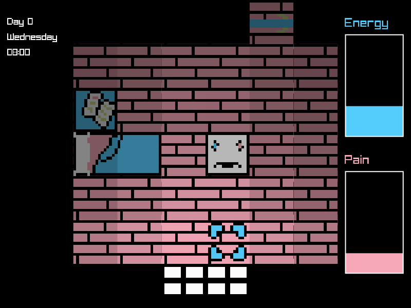
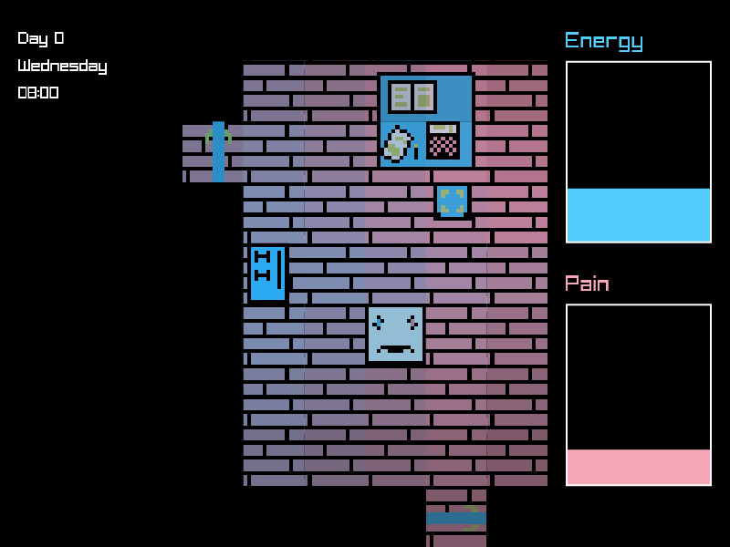
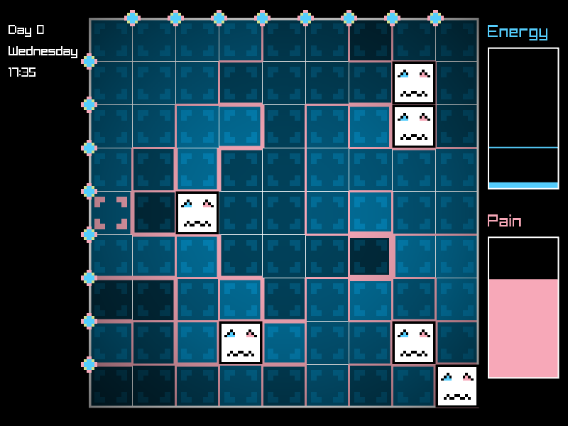

# Transition #3
This code was written as a submission to the Pirate Software game jam.
You can find / play the game on [itch.io](https://elicatza.itch.io/transition-3).





## Game design document

The game design document was written in latex. Building it requires pdflatex
and make.

```bash
make gdd
```

## Build
I don't want to include raylib in this repo, so you have to build and package
it yourself. Depending on if you are building for web or linux you'll need to
use gcc or emscripten. It should not be too difficult. You can do it. However
you should not do it.
